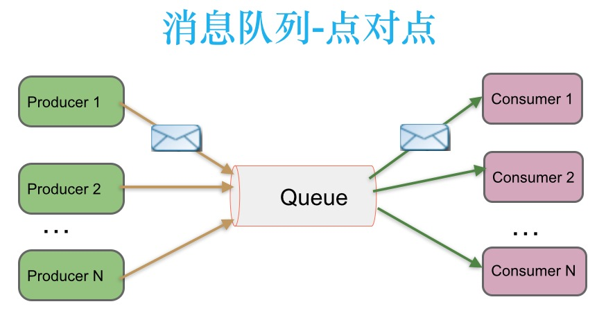
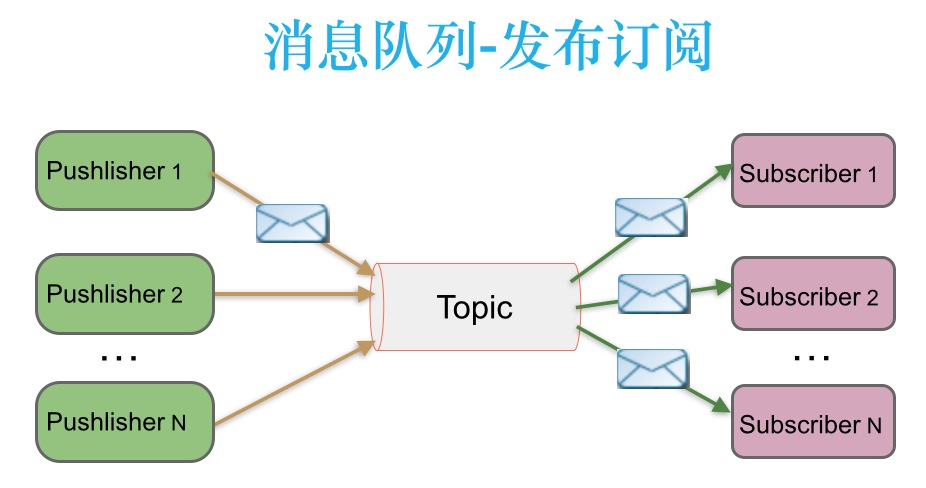

[TOC]

# Kafka入门知识点总结 #

## 消息队列分类：

### 点对点：

消息生产者生产消息发送到queue中，然后消息消费者从queue中取出并且消费信息。

* 消息被消费以后，queue不再有存储，所以消息消费者不可消费到已经被消费的消息
* Queue支持存在多个消费者，但是对一个消息而言，只会有一个消费者可以消费

### 发布/订阅：

消息生产者（发布）将消息发布到topic中，同时有多个消息消费者（订阅）消费该消息。和点对点方式不同，发布到topic的消息会被所有订阅者消费。

